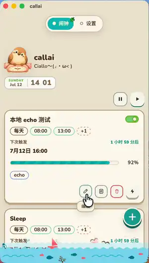
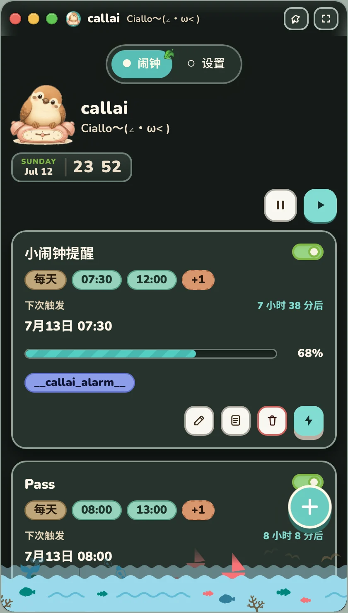
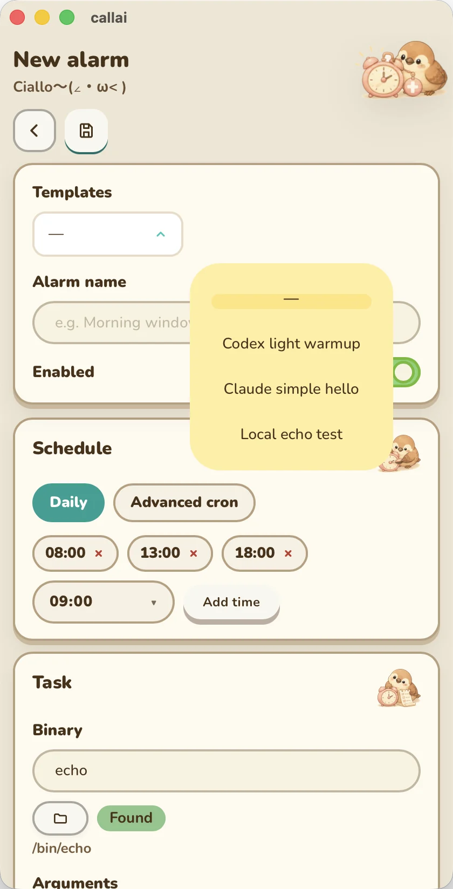
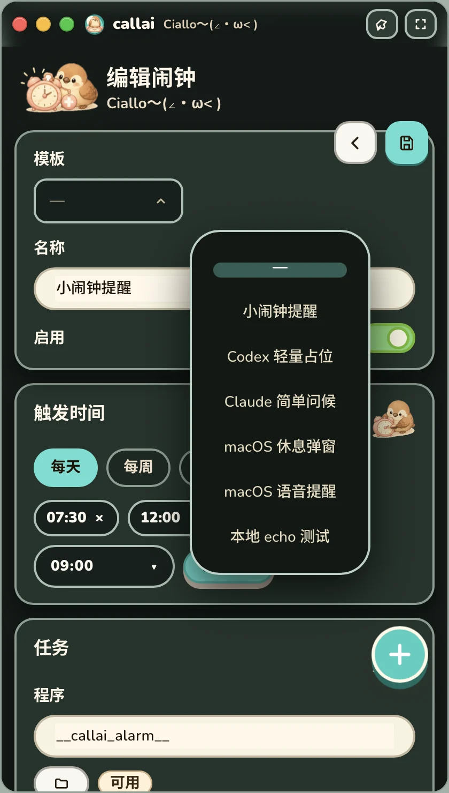
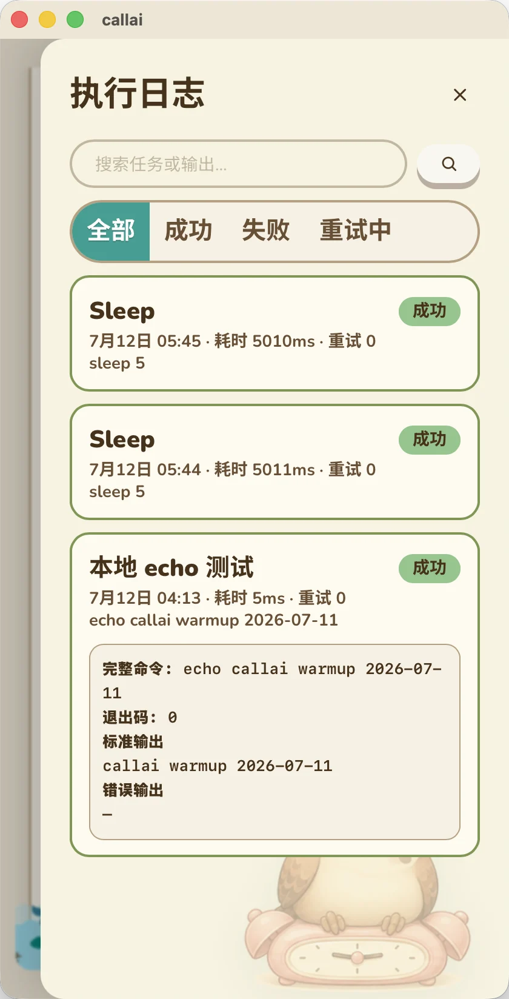
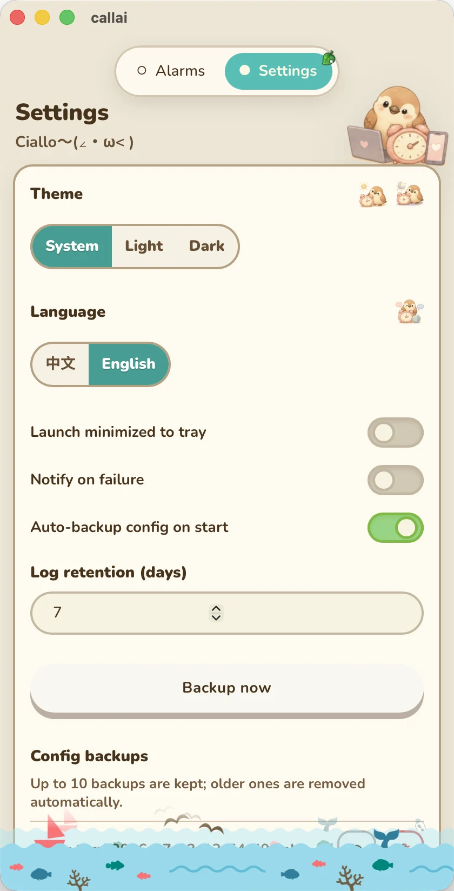

<p align="center">
<table align="center">
<tr>
<td width="160" align="center" valign="middle">
  
</td>
<td align="left" valign="middle">
  <h1>callai</h1>
  <p>
    <strong>Ciallo～(∠・ω&lt; )</strong><br />
    给 AI 定闹钟，也是跨平台轻量定时触发器。
  </p>
</td>
</tr>
</table>
</p>

<p align="center">
  
  &nbsp;
  
  &nbsp;
  
  &nbsp;
  
</p>

<p align="center">
  <a href="./README.md">English</a>
  ·
  <a href="https://github.com/YuniqueUnic/callai/releases">发布页</a>
  ·
  <a href="./CONTRIBUTING.md">贡献指南</a>
</p>

<p align="center">
  <a href="https://github.com/YuniqueUnic/callai/actions/workflows/ci.yml"></a>
  <a href="https://github.com/YuniqueUnic/callai/actions/workflows/release.yml"></a>
  <a href="./LICENSE"></a>
  <!-- x-release-please-version -->
  
  
  
</p>

---

## 演示

<p align="center">
  
</p>

<p align="center">
  <em>1.7 倍速预览</em> ·
  <a href="docs/assets/screenshot/record-preview.gif">GIF</a> ·
  <a href="docs/assets/screenshot/record.mp4">完整 MP4</a> ·
  <a href="docs/assets/screenshot/record.webp">完整 WebP</a>
</p>

### 截图

<p align="center">
<table>
  <tr>
    <td align="center" width="20%" valign="top">
      <a href="docs/assets/screenshot/alarms.png"></a><br />
      <sub><b>闹钟</b> · 暗色</sub>
    </td>
    <td align="center" width="20%" valign="top">
      <a href="docs/assets/screenshot/new-alarm.png"></a><br />
      <sub><b>编辑</b> · 浅色</sub>
    </td>
    <td align="center" width="20%" valign="top">
      <a href="docs/assets/screenshot/edit-alarm-dark.png"></a><br />
      <sub><b>编辑</b> · 暗色</sub>
    </td>
    <td align="center" width="20%" valign="top">
      <a href="docs/assets/screenshot/logs.png"></a><br />
      <sub><b>日志</b> · 浅色</sub>
    </td>
    <td align="center" width="20%" valign="top">
      <a href="docs/assets/screenshot/settings.png"></a><br />
      <sub><b>设置</b> · 浅色</sub>
    </td>
  </tr>
</table>
</p>

## 安装

### 包管理器（GUI + CLI）

| 管理器 | GUI | CLI |
| --- | --- | --- |
| Homebrew | `brew tap YuniqueUnic/homebrew-callai && brew install --cask callai-app` | `brew tap YuniqueUnic/homebrew-callai && brew install callai` |
| Scoop | `scoop bucket add callai https://github.com/YuniqueUnic/scoop-callai && scoop install callai` | `scoop bucket add callai https://github.com/YuniqueUnic/scoop-callai && scoop install callai-cli` |
| winget | 社区 PR（**每个 PR 只能一个应用**，GUI 单独一条）→ 通过后 `winget install YuniqueUnic.Callai` · 本地：`winget install --manifest packaging/winget/manifests/y/YuniqueUnic/Callai/0.3.0` | CLI 需**另开 PR** → `winget install YuniqueUnic.Callai.CLI` · 本地：`--manifest .../Callai.CLI/0.3.0` |

完整矩阵、刷新脚本与上游提交说明见 **[packaging/README.md](./packaging/README.md)**。

```bash
# 发版后刷新清单 hash/version
./packaging/scripts/generate_from_release.sh v0.3.0
just packaging-validate
```

### 直接下载

安装包与 CLI 二进制见 [Releases](https://github.com/YuniqueUnic/callai/releases)。

## 为什么需要 callai？

<p align="center">
  
  &nbsp;&nbsp;→&nbsp;&nbsp;
  
  &nbsp;&nbsp;→&nbsp;&nbsp;
  
</p>

Claude、ChatGPT、Codex 等常见 AI 工具普遍采用**滚动窗口（Rolling Window）**额度机制。真实痛点：

> 上午 9:30 开始高强度使用，中午前后额度烧光；午后再等很久窗口才滑出旧消耗。

**callai** 是一个动森气质的小闹钟：在设定时间触发极轻量任务（如 `echo hi` / `codex exec hi`），提前“占位”，让黄金工作时段窗口更新鲜。

推荐配置：每天几次温和触发（例如 08:00 / 13:00 / 18:00）。


## 玩法菜谱（不止 AI 额度）

**callai** 的原点是温柔的 **AI 滚动额度窗口** 管理，但底层是一个 **轻量、跨平台的定时触发器**：定时间 → 跑任意 binary/脚本 → 有日志、重试、超时、手动停止。比系统 `crontab` 更友好，也比 Windows「任务计划程序」更轻。

> 弹窗 / `say` 等交互命令请设置 **超时**（默认 20s）。否则对话框不点会一直 Running。
>
> **参数解析：** 可直接粘贴 shell 风格一行（如 `-e 'display dialog "hi"'`）。执行前会用 [`shlex`](https://docs.rs/shlex) 拆成真实 argv，不会把外层引号原样塞给程序。

### 1）AI 额度窗口（本职工作）

| 字段 | 示例 |
| --- | --- |
| 程序 | `codex` / `claude` / `echo` |
| 参数 | `exec` + `hi` · 或 `-p` + `hi` · 或 `callai warmup {{date}}` |
| 时间 | 每天 `08:00` / `13:00` / `18:00` |
| 超时 | CLI 较慢时用 `30`–`120` 秒 |

```bash
callai run-once morning-warmup
callai list
callai daemon   # 无 GUI 保活调度
```

### 2）定时强制弹窗（强力打断）

**macOS**（需要图形会话；超时建议 ≥ 60，或你点掉对话框）：

```bash
osascript -e 'display dialog "已经连续写代码 2 小时了，喝口水？" buttons {"已喝", "等会"} default button 1 with icon caution'
```

在 callai 里：binary 填 `osascript`，参数每行一个：

```text
-e
display dialog "已经连续写代码 2 小时了，喝口水？" buttons {"已喝", "等会"} default button 1 with icon caution
```

**Linux（Zenity）：**

```bash
zenity --question --text="写了这么久，要不要强行锁屏休息 5 分钟？" --ok-label="锁屏" --cancel-label="继续卷"
```

### 3）语音 / 多媒体闹钟

**macOS 语音：**

```bash
say -v Mei-Jia "主人，你关注的股票好像跌惨了，快去看看吧"
```

**播音频：**

```bash
# macOS
afplay ~/Music/evangelion_warning.mp3
# Linux
aplay ~/Music/alarm.wav
```

### 4）环境自动切换

**macOS 快捷指令：**

```bash
shortcuts run "开启下班摸鱼模式"
```

例如 18:30 触发：关 IDE、开音乐、调暗屏幕……都写在快捷指令里即可。

### 5）静默后台自动化

**定时 git pull：**

```bash
bash
-lc
cd ~/Projects/my-main-repo && git pull --ff-only origin main
```

**本地服务探活 + 通知：**

```bash
bash
-lc
curl -sf http://localhost:8080/health || osascript -e 'display notification "本地服务挂了！" with title "callai"'
```

### 小提示

- 优先用 **绝对路径** 或确认在 `PATH` 上（`which codex` / `which say`）。
- 交互任务：加大 **超时**，或用 UI **停止** / CLI `run-once` 时 **Ctrl+C**。
- 失败可开 **系统通知**（设置页）。
- 桌面端与 CLI 共用 `~/.config/callai` 与 `~/.local/share/callai`。

## 功能概览

| | 功能 | 说明 |
| :---: | --- | --- |
|  | **闹钟 = 任务** | binary + 参数 + 调度 + ENV；本地墙钟时区 |
|  | **温柔的时间** | 每天 / 每周 / 每月 + cron · 单闹钟通知音 |
|  | **AI 助手** | 闹钟 / 插件 / 聊天三模式 · 流式 · 草稿落地 · 历史 |
|  | **插件** | 内置小岛小应用 + zip 安装/导出 · host 主题与设置条 |
|  | **桌面 + CLI + MCP** | GUI、无界面 `run`/`daemon`，以及给 agent 用的 MCP |
|  | **主题 + 多语言** | 亮 / 暗 / 跟随系统 · 中英 · Animal Island UI |
|  | **日志与重试** | 本地历史、柔和重试、失败系统通知 |
|  | **原生托盘** | macOS 自适应托盘剪影 |
|  | **自动更新** | Tauri updater，读取 GitHub Releases |
|  | **跨平台** | macOS · Windows · Linux CI 构建 |


## 插件与 AI

### 内置插件

首次安装会 seed 到用户插件目录（可删除；删除后不会自动重装）。与普通插件同一运行时：`__callai_plugin__` + ENV 同名覆盖。

| id | 名称 | 能力 |
| --- | --- | --- |
| `todo` | TODO | 轻量待办 + 备注 |
| `pomodoro` | 番茄时钟 | 专注 / 短休 / 长休 + 通知 |
| `meal-spin` | 今天吃喝什么 | 吃/喝转盘；ENV `mode=food\|drink` |
| `work-report` | 工作汇报 | 日 / 周 / 月报 |
| `ledger` | 小岛记账 | 日历 + 竖向时间线 · 分类 · 区间汇总 |

源码目录：[`src-tauri/templates/builtin_plugins/`](./src-tauri/templates/builtin_plugins/)。开发说明：[内置插件 README](./src-tauri/templates/builtin_plugins/README.md)。

### 插件平台（要点）

- **settings ≡ params**：storage 一套 key；闹钟 ENV 同名 key **仅本次打开覆盖**（不写回）。
- **Host bar**：主题 / 通知 / 设置 / 闹钟覆盖 chip，插件 `ui.html` 不必重复实现。
- **Zip**：安装（选文件 / 拖放）、导出（裸包或含数据）；按 `manifest.id` + 版本更新；禁止静默降级。
- **市场预备**：registry schema 文档见 `docs/`，便于后续 GitHub 市场。

### AI 助手

- 模式：**闹钟草稿** · **插件草稿** · **聊天**（自由文本，不强行 JSON）。
- 经 Tauri 代理流式输出（OpenAI 兼容 chat/responses）。
- 草稿可一键落地为闹钟/插件；历史多选删除带二次确认。

### MCP（给 agent）

- `callai mcp-server`（stdio）与 HTTP MCP，方便 Codex / Claude 等 CLI。
- 闹钟、插件、日志、prompts 等工具说明见 [`docs/mcp.md`](./docs/mcp.md)。

## 下载与首次打开（未公证 / 未签名安装包）

[Releases](https://github.com/YuniqueUnic/callai/releases) 上的安装包**没有**走 Apple 公证 / Windows 商业代码签名（仅有开源 updater 的 minisign 密钥）。系统拦截是正常现象，按下面步骤即可使用。

### macOS

```bash
# 把 callai.app 拖进「应用程序」之后：
xattr -dr com.apple.quarantine /Applications/callai.app
# 或清理扩展属性：
xattr -cr /Applications/callai.app
open /Applications/callai.app
```

仍被拦截时：**右键 → 打开** 一次，或 **系统设置 → 隐私与安全性 → 仍要打开**。

### Windows

1. 运行 Releases 中的 `.msi` 或 `-setup.exe`  
2. 若出现 SmartScreen：**更多信息 → 仍要运行**

### Linux

```bash
chmod +x callai_*.AppImage
./callai_*.AppImage
# 或安装 .deb / .rpm
```

### CLI

同一发布页提供 `callai-cli-*`，可无 GUI 运行 `run` / `daemon`。

## 自动更新

桌面版内置 **tauri-plugin-updater**：

- 端点：`https://github.com/YuniqueUnic/callai/releases/latest/download/latest.json`
- 更新包使用 minisign 签名，公钥写在 `src-tauri/tauri.conf.json`
- 应用内：**设置 → 检查更新**

维护者需在 GitHub Actions 配置密钥 `TAURI_SIGNING_PRIVATE_KEY`（及可选 `TAURI_SIGNING_PRIVATE_KEY_PASSWORD`），release CI 才能签名 updater 产物。私钥不要提交进仓库（本地 `.keys/` 已 gitignore）。

## 技术栈

| 层级 | 技术 |
| --- | --- |
| 前端 | TypeScript · React · Vite 8 · Bun · [animal-island-ui](https://github.com/guokaigdg/animal-island-ui) |
| 壳 | Tauri 2（含 updater） |
| 核心 | Rust（`domain` / `app` / `infra`） |
| 存储 | SQLite + `config.toml` 备份 |
| 发布 | release-please（semver）+ GitHub Actions 多平台构建 |

**当前版本：** `0.3.0` <!-- x-release-please-version -->

## 快速开始（开发）

```bash
just setup
just dev
just dev-web
```

```bash
bun install
bun run tauri dev
```

### CLI（与桌面共享数据）

```bash
cargo build --manifest-path src-tauri/Cargo.toml
./src-tauri/target/debug/callai list
./src-tauri/target/debug/callai run
./src-tauri/target/debug/callai daemon
./src-tauri/target/debug/callai run-once <name|id>
./src-tauri/target/debug/callai validate
./src-tauri/target/debug/callai app
```

### 数据位置

| 类型 | 路径 |
| --- | --- |
| 配置 | `~/.config/callai/config.toml` |
| 备份 | `~/.config/callai/backups/`（最多 10 份） |
| 数据库 | `~/.local/share/callai/callai.db` |

## 架构（简）

```
src/                 # UI + 前端领域 + Tauri bridge
src-tauri/
  src/domain/        # 纯 Rust 规则（闹钟 / 插件 / 调度 / 时区）
  src/app/           # 用例 + ports
  src/infra/         # sqlite / process / toml / scheduler / plugin host / MCP / AI
  src/commands/      # Tauri 命令
  templates/         # 内置插件 + host panel + prompts
```

依赖方向：**UI → domain ← infra**。

## 质量门禁

```bash
./scripts/check_versions.sh
just gate
```

## CI / CD 与版本管理

- **CI**：push / PR 到 `main`
- **Release**：release-please 开 PR；合并后打 tag 并构建桌面 + CLI（配置签名密钥时附带 updater 产物）

版本源：`package.json` / `tauri.conf.json` / `Cargo.toml` / `.release-please-manifest.json` / README 标记。

## 品牌 / 截图脚本

```bash
just brand
./scripts/media/optimize_screenshots.sh  # original/* → docs webp/png
```

## 文档

- [PRODUCT.md](./PRODUCT.md) · [DESIGN.md](./DESIGN.md) · [usecases/](./usecases/)
- [MCP 说明](./docs/mcp.md) · [内置插件](./src-tauri/templates/builtin_plugins/README.md)
- [开发过程 records（教学）](./docs/development/README.md)
- [CONTRIBUTING.md](./CONTRIBUTING.md) · [CODE_OF_CONDUCT.md](./CODE_OF_CONDUCT.md) · [SECURITY.md](./SECURITY.md)

## Links

- [Homebrew tap](https://github.com/YuniqueUnic/homebrew-callai)
- [Scoop bucket](https://github.com/YuniqueUnic/scoop-callai)
- [winget GUI PR](https://github.com/microsoft/winget-pkgs/pull/401366) · [winget CLI PR](https://github.com/microsoft/winget-pkgs/pull/401367)
- [GitHub](https://github.com/YuniqueUnic/callai)
- [Releases](https://github.com/YuniqueUnic/callai/releases)
- [LinuxDo](https://linux.do)
- [animal-island-ui](https://github.com/guokaigdg/animal-island-ui)
- [开发过程 records](./docs/development/README.md)

## 许可

- 源码：[MIT](./LICENSE)
- UI：`animal-island-ui` 为 **CC BY-NC 4.0**。个人 / 非商业可用；商业分发需换库或授权。

---

<p align="center">
  
  <br />
  <em>Ciallo～(∠・ω&lt; ) — 让 AI 的窗口一直暖着。</em>
</p>
